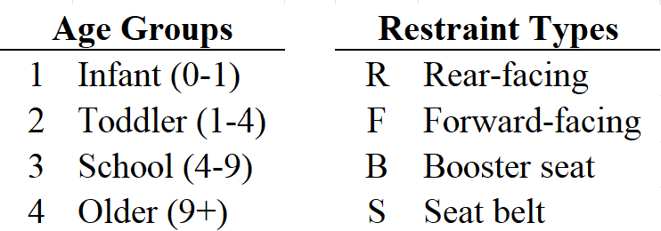
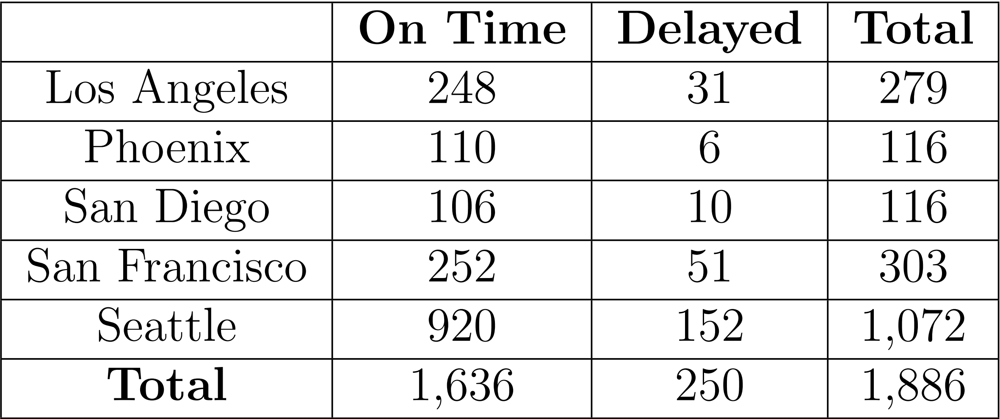
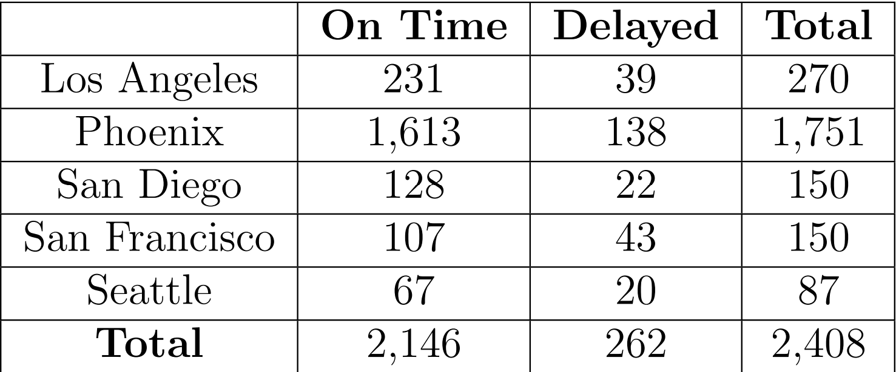

# 1. Child Safety Seat Survey
Canada has a Road Safety Vision of having the safest roads in the world. Yet, the leading cause of death of Canadian children remains vehicle crashes. In 2006, a national child safety seat survey was conducted by an AUTO21 research team in collaboration with Transport Canada to empirically measure Canada’s progress toward achieving Road Safety Vision 20210. Child seat use was observed in parking lots and nearby intersections in 200 randomly selected sites across Canada.

## 1.1 Contingency Table
>Using data table, create a 4×4 cross-tabulation (i.e., contingency or pivot table) of the children in the survey by age group (row position) and type of restraint (columnposition).

## 1.2 Data Types
>What are the variables measured in this survey? Are they qualitative (i.e., categorical) or quantitative?

## 1.3 Side-by-Side Bar Chart
>Construct a side-by-side bar chart to compare the type of restraints at different age groups.

## 1.4 Pie and Stacked Bar Charts
>Construct pie charts or a stacked bar chart to compare the type of restraints at different age groups.

## 1.5 Summary of Data
>Write a short paragraph summarizing the information that can be gained by looking at these graphs.

# 2. National Cable Service
Like all companies, cable companies send stakeholders reports on their profits, dividends, and return on equity. They often supplement this information with some metrics unique to the cable business. To construct one such metric, a cable company can compare the number of households it actually serves to the number of households its current transmission lines could reach (without extending lines). The number of households that the cable company’s lines could reach is called its number of cable passings, while the ratio of the number of households the cable company actually serves to its number of cable passings is called the company’s cable penetration. There are various types of cable penetrations - one for cable television, one for cable internet, once for cable phone, and others. For example, National cable television penetration is a probability defined as follows:

$$
\frac{\text{the number of cable passings that have National’s cable television services}}
{\text{the total number of cable passings}}
$$

National’s cable has 38 million cable passings. Let us consider National cable’s two services viz. cable television service (A) and cable internet service (B). 10.9 million has only cable television service and 10.1 million has only cable internet service, while 8.2 million has both services.

## 2.1 Contingency Tables
>Create a 2 × 2 contingency table considering cable television service (A) in the row position and cable internet service in the column position (B).

## 2.2 Probability of Union
>What is the probability that a randomly selected cable passing has either cable television service or cable internet service?

## 2.3 Probability of Intersection
>What is the probability that a randomly selected cable passing does not have National’s cable television service and does not have National’s cable internet service?

## 2.4 Mutually Exclusive Events
>Are the events cable television service and cable internet service mutually exclusive? Justify.

## 2.5 Independence of Events
>Are the events cable television service and cable internet service independent? Justify.

## 2.6 Conditional Probability
>If a randomly selected cable has television service, what is the probability that it does not have cable internet service?

# 3. Flight Delays
Below we give two contingency tables of data from reports submitted by airlines to the U.S.
Department of Transportation. The data concern the numbers of on-time and delayed flights
for Delta and Frontier Airlines at five major airports.

## 3.1
>What percentage of all Delta Airlines flights were delayed? That is, use the data to estimate the probability that an Delta Airline flight will be delayed. Do the same for Frontier Airlines? Which airline does best overall?

## 3.2
>For Delta Airlines, find the percentage of delayed flights at each airport. That is, use the data to estimate each of the probabilities P(delayed | Los Angeles), P(delayed | Phoenix), and so on. Then do the same for Frontier Airlines. Which airline does best at each individual airport?

## 3.3
>Compare the results of part 3.1 and 3.2 i.e., the performance of both airlines? Are they aligned or contradictory? Explain.
